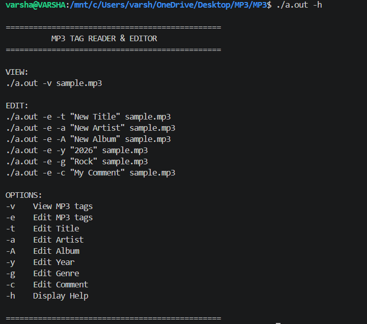
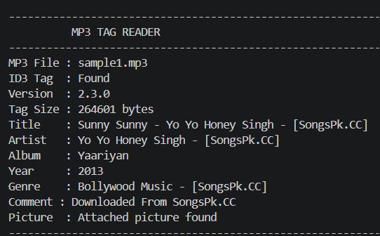
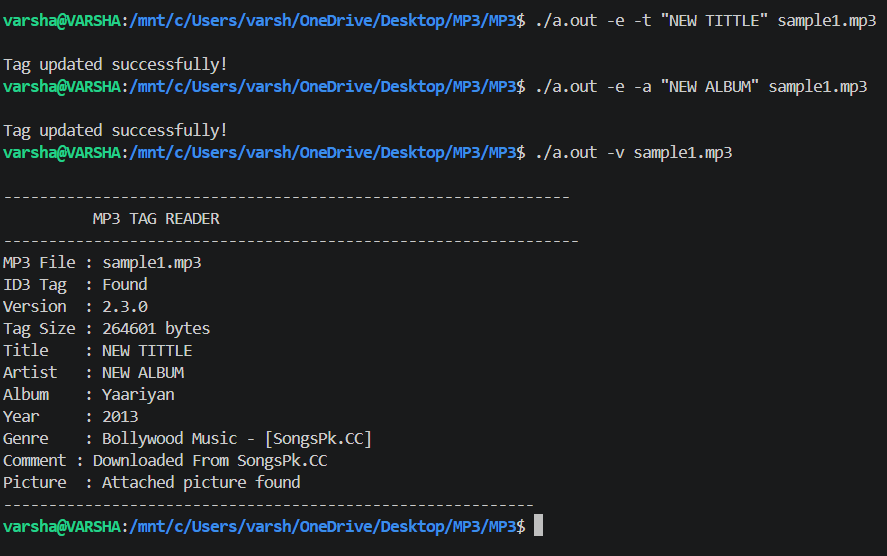

# MP3 Tag Reader & Editor

## 📌 Project Description

The **MP3 Tag Reader & Editor** is a C-based command-line application used to read and edit metadata (ID3 tags) stored inside MP3 files.

The project supports viewing and editing common MP3 information such as:

* Title
* Artist
* Album
* Year
* Genre
* Comment

The project works with **ID3v2.3** MP3 metadata.

---

## ✨ Features

* View MP3 metadata
* Edit MP3 metadata
* Support for ID3v2.3 tags
* Command-line interface
* Detect attached pictures in MP3 files
* Error handling for invalid files and operations
* Temporary file handling during editing

---

## 🏷️ Supported Tags

| Option | Frame ID | Description  |
| ------ | -------- | ------------ |
| `-t`   | `TIT2`   | Edit Title   |
| `-a`   | `TPE1`   | Edit Artist  |
| `-A`   | `TALB`   | Edit Album   |
| `-y`   | `TYER`   | Edit Year    |
| `-g`   | `TCON`   | Edit Genre   |
| `-c`   | `COMM`   | Edit Comment |

---

## 🛠️ Technologies Used

* C Programming
* File Handling
* Structures
* Pointers
* Dynamic Memory Allocation
* String Handling
* Binary File Handling
* Command-Line Arguments
* ID3v2.3 Metadata Processing

---

## 📂 Project Structure

```text
MP3-Tag-Reader-Editor-C/
│
├── main.c
├── view.c
├── view.h
├── edit.c
├── edit.h
├── help.c
├── help.h
└── operations.h
```

---

## ⚙️ Compilation

Compile the project using GCC:

```bash
gcc main.c view.c edit.c help.c -o a.out
```

---

## ▶️ Usage

### 1. View MP3 Tags

```bash
./a.out -v sample.mp3
```

This displays information such as:

* Title
* Artist
* Album
* Year
* Genre
* Comment
* Attached picture information

---

### 2. Edit Title

```bash
./a.out -e -t "New Title" sample.mp3
```

---

### 3. Edit Artist

```bash
./a.out -e -a "New Artist" sample.mp3
```

---

### 4. Edit Album

```bash
./a.out -e -A "New Album" sample.mp3
```

---

### 5. Edit Year

```bash
./a.out -e -y "2026" sample.mp3
```

---

### 6. Edit Genre

```bash
./a.out -e -g "Rock" sample.mp3
```

---

### 7. Edit Comment

```bash
./a.out -e -c "My Comment" sample.mp3
```

---

### 8. Display Help

```bash
./a.out -h
```

---

## 🧠 How It Works

The program reads the **ID3v2.3 header** from the MP3 file and identifies the metadata frames.

Each frame contains:

1. Frame ID
2. Frame Size
3. Frame Flags
4. Frame Data

For example:

```text
TIT2 → Title
TPE1 → Artist
TALB → Album
TYER → Year
TCON → Genre
COMM → Comment
APIC → Attached Picture
```

### View Operation

The program:

1. Opens the MP3 file in binary read mode.
2. Reads the ID3 header.
3. Checks whether the ID3 tag is present.
4. Reads the tag size.
5. Reads each frame.
6. Identifies the required frame using its frame ID.
7. Displays the corresponding metadata.

### Edit Operation

The program:

1. Opens the original MP3 file.
2. Reads the ID3 header.
3. Finds the required metadata frame.
4. Creates a temporary file.
5. Copies the existing MP3 data.
6. Replaces the selected frame data.
7. Writes the updated data into the temporary file.
8. Replaces the original MP3 file with the updated file.

---

## 🖥️ Sample Output

### Help



### View



### Edit and Update



### View MP3 Tags

Example output:

```text
----------------------------------------
          MP3 TAG READER
----------------------------------------
MP3 File : sample.mp3
ID3 Tag  : Found
Version  : 2.3.0
Tag Size : 264601 bytes
Title    : Sunny
Artist   : Example Artist
Album    : Example Album
Year     : 2026
Genre    : Rock
Comment  : My Comment
Picture  : Attached picture found
----------------------------------------
```

### Edit Output

```text
Tag updated successfully!
```

> Add your actual program output screenshot here after uploading it to the `screenshots` folder.

---

## 🎯 Learning Outcomes

Through this project, I gained practical experience in:

* C programming
* Binary file handling
* File pointers and file operations
* Command-line argument handling
* Dynamic memory allocation
* Structures and enumerations
* String manipulation
* Reading and writing binary data
* Working with temporary files
* Understanding ID3v2.3 metadata
* Modular programming using `.c` and `.h` files

---

## ⚠️ Note

The project currently updates existing metadata frames while preserving the existing frame size.

If the new text is larger than the available frame space, the program reports an error instead of modifying the file incorrectly.

---

## 👩‍💻 Author

**Varsha M**

ECE Engineering Graduate
Embedded Systems Trainee
